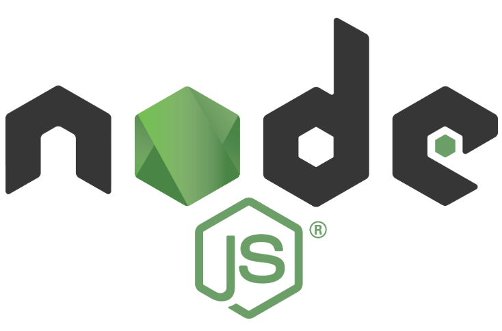

<h1 align="center">
   
  
   
  
  
  

   
    Alpine + Nodejs + Git
   
</h1>

  <a href="#description">Description</a> •
  <a href="#find-us">Find Us</a> •
  <a href="#authors">Authors</a> •
  <a href="#license">License</a>

## Description

Run `jest --watch` inside an alpine linux container with Nodejs 11

## Find Us

* [GitHub](https://github.com/tomnlittle/docker-node-jest)
* [Dockerhub](https://cloud.docker.com/repository/registry-1.docker.io/tomnlittle/node-jest)

## Authors

* **Thomas Northall-Little**

## License

This project is licensed under the MIT License - see the [LICENSE.md](LICENSE.md) file for details.
